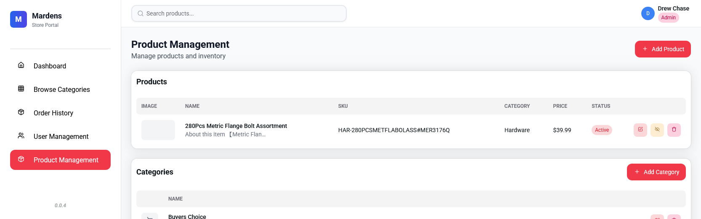

# Store Orders Portal

A full‑stack inventory and purchase ordering portal for Mardens stores. It enables store users to browse catalog categories and products, build carts, submit orders, and track fulfillment. Admin users manage users, stores, categories, products, and can disable/enable accounts.

> Tech Stack: **TAVRN** (TypeScript + TailwindCSS + Actix + Vite + React + NextUI/HeroUI) with a Rust (Actix-web + SQLx) backend and a React 18 SPA frontend.

---

## Table of Contents

- [Features](#features)
- [Architecture Overview](#architecture-overview)
- [Directory Structure](#directory-structure)
- [Data Model / Database Schema](#data-model--database-schema)
- [Authentication & Authorization](#authentication--authorization)
- [Disabled User Workflow](#disabled-user-workflow)
- [Password Reset & New User Onboarding Flow](#password-reset--new-user-onboarding-flow)
- [Email Service](#email-service)
- [Environment Variables](#environment-variables)
- [Local Development](#local-development)
- [Build & Deployment](#build--deployment)
- [Available NPM Scripts](#available-npm-scripts)
- [API Overview](#api-overview)
- [Frontend Overview](#frontend-overview)
- [Image & File Handling](#image--file-handling)
- [Security Notes & Hardening TODOs](#security-notes--hardening-todos)
- [Testing](#testing)
- [Troubleshooting](#troubleshooting)
- [Screenshots](#screenshots)
- [Contributing](#contributing)
- [License](#license)
- [Attribution / Notes](#attribution--notes)

---

## Features

- Store user login with JWT + refresh tokens
- Role-based authorization (admin vs. store)
- Category & product management (with images, stock, price)
- Order creation, itemized order lines, status tracking (Pending → Shipped → Delivered)
- Soft disabling of users with optional expiration and reason
- Password reset and new user password setup via emailed one-time token (1-hour validity)
- Self-service forgot password flow
- Admin user CRUD (create without a password → email setup link)
- Store records management

---

## Architecture Overview

```
+-------------------+        +-----------------------+
|  React (Vite SPA) | <----> | Actix-Web (Rust API)  |
|  HeroUI / Tailwind|        | Auth, Orders, Products|
+-------------------+        +-----------+-----------+
            |                             |
            | (Static assets / Dev Proxy) |
            v                             v
      Vite Dev Server (dev)        MySQL (SQLx)
```

Backend responsibilities:

- HTTP API under `/api/*`
- Authentication (JWT issuance & verification; refresh flow)
- Table bootstrapping (auto-creates tables at startup if absent)
- Business logic for orders, products, categories, stores, users
- Email dispatch for password workflows
- Periodic cleanup of expired disabled-user records

Frontend responsibilities:

- SPA routing (React Router v7) & protected routes
- UI for browsing, ordering, and admin management
- Token storage & refresh handling (via AuthProvider)

---

## Directory Structure

```
root
├─ src/                    # Frontend (React + TS + Vite)
│  ├─ components/          # Reusable UI components & modals
│  ├─ pages/               # Route-level pages
│  ├─ providers/           # Context providers (Auth, Cart, Layout)
│  ├─ utils/               # API helper, types, image resizing
│  └─ css/                 # Tailwind & 3rd party styles
├─ src-actix/              # Rust backend crate
│  ├─ auth/                # Auth modules (JWT, endpoints, email, disabled users)
│  ├─ categories/
│  ├─ products/
│  ├─ orders/
│  ├─ stores/
│  ├─ upload.rs            # File upload / image endpoint(s)
│  ├─ asset_endpoint.rs    # Version / asset helpers
│  └─ lib.rs               # Server assembly & startup
├─ openapi.json            # (If maintained) spec stub / future docs
├─ Cargo.toml / Cargo.lock
├─ package.json / pnpm-lock.yaml
├─ vite.config.ts / tailwind.config.js / tsconfig.json
└─ README.md
```

---

## Data Model / Database Schema

Tables are auto-created (idempotently) at startup via SQL executed in each module. (Assumes a MySQL-compatible database.)

| Table                   | Purpose                              | Key Columns / Notes                                                  |
|-------------------------|--------------------------------------|----------------------------------------------------------------------|
| `stores`                | Physical store locations             | `id`, `city`, `address`                                              |
| `users`                 | Application users                    | `email (unique)`, `role (admin                                       |store)`, `store_id?` (FK) |
| `disabled_users`        | Tracks disabled state (soft lockout) | `user_id PK`, `reason`, `expiration?`                                |
| `password_reset_tokens` | One-time password/setup tokens       | `token (UUID)`, `expires_at`, `used`                                 |
| `categories`            | Product taxonomy                     | Self-referencing `parent_id`, `is_active`, `sort_order`              |
| `products`              | Items available for ordering         | `sku (unique)`, `category_id`, `price`, `stock_quantity`, `in_stock` |
| `orders`                | Store purchase orders                | `order_number (unique)`, `user_id`, `store_id`, `status` (ENUM)      |
| `order_items`           | Line items per order                 | `order_id`, `product_id`, `quantity`, `unit_price`, `total_price`    |

Status enums:

- Orders: `PENDING`, `SHIPPED`, `DELIVERED`

Automatic behaviors:

- Stock decremented on order creation (with `in_stock` recalculated).
- Disabled user cleanup task runs periodically (expired rows removed).
- Password reset tokens are invalidated when reused or expired.

---

## Authentication & Authorization

Flow:

1. User submits email/password to `/api/auth/login`.
2. Backend verifies credentials (bcrypt) & domain restriction (`@mardens.com`).
3. Issues: (a) Access JWT (24h) + (b) Refresh token (30d) — both signed HS256.
4. Access token required in `Authorization: Bearer <token>` for protected endpoints.
5. `/api/auth/refresh` exchanges a valid refresh token for fresh access and refresh tokens.
6. Middleware (`jwt_validator`) injects decoded claims into request extensions.
7. Admin-only endpoints check `claims.role == "admin"`.

Claims include:

```
sub: user id (u64)
email: user email
role: "admin" | "store"
store_id: optional store reference
exp / iat: expiry & issued-at
```

ID Obfuscation: Public responses encode numeric IDs via `serde_hash::hashids` to avoid exposing raw sequential integers.

---

## Disabled User Workflow

- Admin can disable a user (`/api/auth/admin/disable-user`) with reason and optional expiration.
- Middleware blocks disabled users early, returning 403 JSON with reason and expiration.
- Re-enable: `/api/auth/admin/enable-user/{user_id}` deletes the disabled row.
- Background task purges expired disabled records every 24h.

---

## Password Reset & New User Onboarding Flow

- Admin creates a user without a password → temp random password hashed → reset token created.
- Email sent with one-time setup link (`/reset-password?token=...`).
- Token validity: single-use, 1 hour.
- Forgot password uses the same token creation and email template (existing-user variant).
- After successful password change token marked `used = TRUE`.

---

## Email Service

Located in `src-actix/auth/email_service.rs` using `lettre` with STARTTLS (Office 365). Currently, **credentials & SMTP host are hard-coded** (development placeholder). This must be externalized to environment variables before production.

Recommended variables:

```
SMTP_HOST=smtp.office365.com
SMTP_USERNAME=...
SMTP_PASSWORD=...
SMTP_FROM=store-portal@mardens.com
PUBLIC_BASE_URL=https://store-orders.mardens.com
DEV_BASE_URL=http://127.0.0.1:1422
```

---

## Environment Variables

Below is a consolidated list (some inferred; see NOTE). Create a `.env` (and do NOT commit secrets).

```
# --- JWT Secrets (remove hard-coded fallbacks from jwt.rs for production) ---
JWT_ACCESS_SECRET=replace_with_strong_random
JWT_REFRESH_SECRET=replace_with_strong_random_refresh

# --- Email / SMTP ---
SMTP_HOST=smtp.office365.com
SMTP_USERNAME=YOUR_USER@domain.com
SMTP_PASSWORD=super_secret
SMTP_FROM=Store Orders Portal <no-reply@domain.com>

# --- App / Server ---
APP_PORT=1422
RUST_LOG=info,store_orders=debug
NODE_ENV=development
PUBLIC_BASE_URL=http://127.0.0.1:1422
```

NOTE: The `database_common_lib` crate determines exact variable names; adjust if its documentation differs.

See `.env.example` for a templated version.

---

## Local Development

Prerequisites:

- Rust (stable >= 1.78) & Cargo
- Node.js (>= 20) + npm / pnpm
- MySQL 8.x (or compatible, e.g., MariaDB 10.6+)
- (Optional) WSL2 for Windows builds (script uses `wsl bash -ic` in `build-api`)

Steps:

1. Clone repo
2. Copy `.env.example` to `.env` & fill secrets
3. Create database: `CREATE DATABASE stores CHARACTER SET utf8mb4 COLLATE utf8mb4_unicode_ci;`
4. Install frontend deps: `npm install`
5. Run combined dev experience:
    - Start backend: `cargo run --bin store_orders`
    - In another shell, start Vite (if not auto-started by backend): `npm run dev`
6. Visit `http://127.0.0.1:1422` (backend proxies/serves SPA)

The backend in debug mode spawns a Vite dev server (see `lib.rs`), enabling HMR.

---

## Build & Deployment

Production build (Rust release and frontend bundle):

```
npm run build
```

This runs:

- `build-frontend`: `tsc && vite build` -> outputs to `dist` (then integrated / served)
- `build-api`: Cargo release build

Binary output: `target/release/store_orders`

Deployment considerations:

- Set real JWT secrets and remove development early `return Ok(b"...")` overrides in `jwt.rs`.
- Externalize SMTP credentials.
- Serve over HTTPS (reverse proxy: Nginx / Traefik) and restrict direct DB access.
- Run with systemd or container orchestrator.

Example systemd unit (snippet):

```
[Service]
EnvironmentFile=/etc/store-orders.env
ExecStart=/opt/store-orders/store_orders
Restart=on-failure
``` 

---

## Available NPM Scripts

| Script           | Action                                                       |
|------------------|--------------------------------------------------------------|
| `dev`            | Run Vite dev server (frontend)                               |
| `build-frontend` | Type-check then build SPA bundle                             |
| `build-api`      | Build Rust backend (release) via WSL helper on Windows       |
| `build`          | Frontend build then backend build                            |
| `run-api`        | Run backend in debug (uses dev features)                     |
| `lint`           | ESLint on TS/TSX                                             |
| `publish`        | Custom deploy helper (copies binary + assets to remote host) |

---

## API Overview

All endpoints prefixed with `/api`. Highlights:

Auth:

- POST `/api/auth/login` – email/password -> tokens
- POST `/api/auth/refresh` – refresh token -> new pair
- GET  `/api/auth/me` – current user profile
- POST `/api/auth/forgot-password`, `/api/auth/reset-password`
- Admin: create/update/delete users, disable/enable, list disabled

Users:

- GET `/api/auth/users` (admin)
- PUT `/api/auth/users/{id}` (admin)
- DELETE `/api/auth/users/{id}` (admin)

Categories:

- CRUD endpoints under `/api/categories/*`

Products:

- CRUD endpoints under `/api/products/*`
- Image upload via `/api/upload` (see `upload.rs`)

Orders:

- Create/list per user / per store
- Status update workflow

Stores:

- CRUD for store locations (admin)

See `openapi.json` (stub) – keeping it updated is recommended (consider integrating `utoipa` or `okapi` crate for Rust-generated OpenAPI in future).

---

## Frontend Overview

- React Router v7 for routing (see `src/components/routing/` & pages)
- Context Providers (`AuthProvider`, `CartProvider`, `LayoutProvider`)
- ProtectedRoute & role-based gating (`RequireRole.tsx`)
- UI Library: HeroUI/NextUI
- TailwindCSS for utility styling (configured in `tailwind.config.js`)
- Error boundary for top-level component resilience

Token Handling Strategy:

- Access & refresh tokens stored (implementation detail: ensure no XSS leaks; consider using httpOnly cookies in future).
- Automatic refresh on expiration path.

---

## Image & File Handling

- Product images stored in `products/` directory (created if absent) and exposed via `GET /products/<filename>` (static file service) – no directory listing.
- Upload endpoint saves file then returns URL path; ensure file extension validation / size limits if expanding (currently not fully described—review `upload.rs`).

---

## Testing

Rust tests:

- JWT round-trip tests in `auth/jwt.rs`
- Email sending test (integration-style) in `auth/email_service.rs` (will attempt real SMTP – disable or mock in CI)

Recommended additions:

- Add unit tests for order creation & stock adjustment
- Add integration tests with an ephemeral MySQL (Docker) & `sqlx::migrate!()` if migrations adopted
- Frontend: add React Testing Library tests for auth flows & forms

Running (Rust):

```
cargo test
```

Running (lint frontend):

```
npm run lint
```

---

## Troubleshooting

| Issue                             | Possible Cause                    | Fix                                                      |
|-----------------------------------|-----------------------------------|----------------------------------------------------------|
| Cannot log in                     | DB not reachable                  | Verify DB env vars & network                             |
| 403 after login                   | User disabled                     | Check `/api/auth/admin/disabled-users`                   |
| Password reset email not received | SMTP blocked / creds invalid      | Verify SMTP env & logs                                   |
| Vite assets not loading in prod   | Build not run / wrong static path | Run `npm run build` & ensure Actix serves `wwwroot`/dist |
| Orders show wrong stock           | Concurrency race                  | Add transactional stock validation                       |

Logs: Controlled by `RUST_LOG` & `pretty_env_logger` (timestamps suppressed for readability). Increase to `debug` for detailed traces.

---

## Screenshots

### Login Page


### Dashboard


### Browse Categories


### Orders


### User Management


### Product Management



---

## Contributing

1. Create a feature branch.
2. Add/Update tests where applicable.
3. Run lint & tests (`npm run lint`, `cargo test`).
4. Open PR with clear summary & any schema changes documented.

---

## License

GPL-3.0-or-later

---

## Attribution / Notes

Internal use for Mardens. Remove hard-coded secrets before any external distribution.
