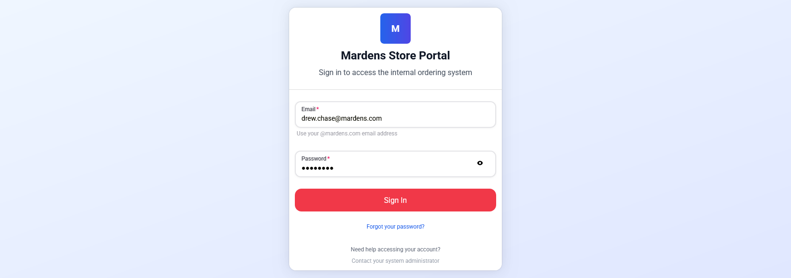

# Store Orders Portal
Welcome to Mardens' Store Orders portal, your one-stop solution for seamless stock management! Streamline the process of ordering inventory from our main distribution center with just a few clicks. Enjoy real-time updates, efficient communication, and optimized stock replenishment for your stores.

## Table of Contents
- Pages
  - [Login Page](#login-page)
  - [Dashboard](#dashboard)
  - [Browse Categories](#browse-categories)
  - [Orders](#orders)
  - [User Mangement](#user-management)
  - [Product Management](#product-management)
- 

## Login Page

The login page is the first page you will see when you open the application. You will need to log in with your **_@mardens.com_** email address to access the application.  If you don't have an account, please contact your store manager or [system administrator](mailto:helpdesk@mardens.com) to create one for you.   
If you have an account but can't remember your password, you can click the _**"Forgot your password?"**_ link.

## Dashboard

The dashboard page is the main page of the application. It displays the total orders, total products, pending orders, and quick links to the other pages.

## Browse Categories

The browse categories page displays a list of all the categories in the system. You can click on a category to view the products in that category. Categories can be created and edited from the [product management page](#product-management).

## Orders

The order history page displays a list of all the orders placed by the user. You can click on an order to view the details of the order.
Orders can be marked as delivered, shipped, or canceled from this page.

## User Mangement

The user management page displays a list of all the users in the system. You can click on a user to view the details of the user.
Users can be created and edited from this page. When a user is created, they will automatically be sent an email with their login credentials.

## Product Management

The product management page displays a list of all the products in the system. You can click on a product to view the details of the product.
Products can be created and edited from this page.

---
## Dependencies
This project was created using the TAVRN _(typescript/tailwindcss, actix, vite, react, nextui/heroui)_ framework.
### Frontend
- [NextUI/HeroUI](https://heroui.org/)
- [React 18](https://reactjs.org/)
- [Vite 7](https://vitejs.dev/)
- [TypeScript 5](https://www.typescriptlang.org/)
- [TailwindCSS 3](https://v3.tailwindcss.com/)
### Backend
- [Actix](https://actix.rs/)
- [SQLX](https://crates.io/crates/sqlx)
- Rust - 2024 edition
